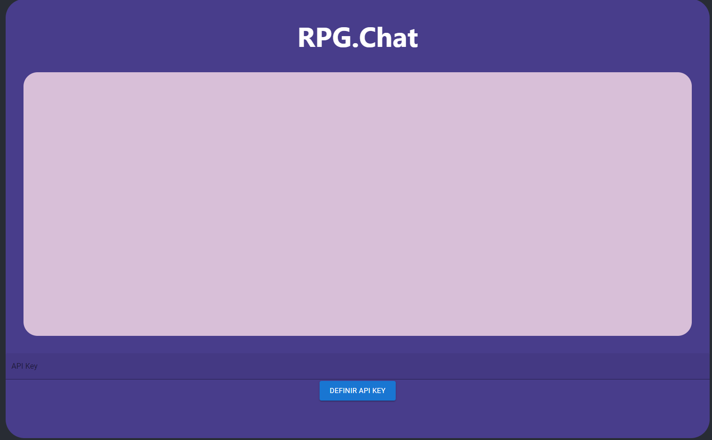
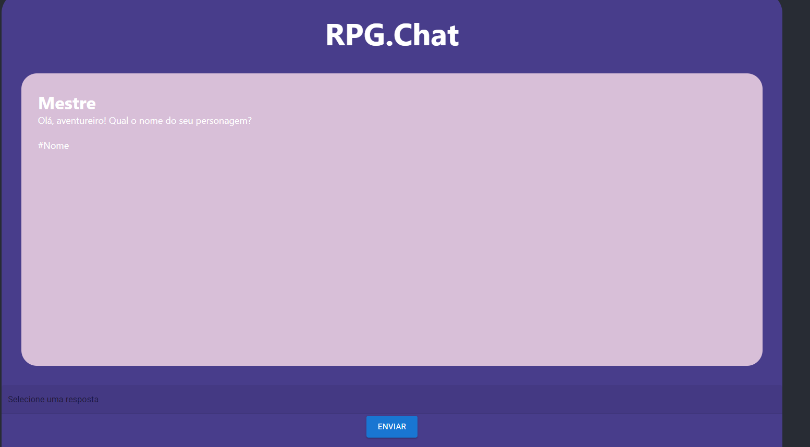
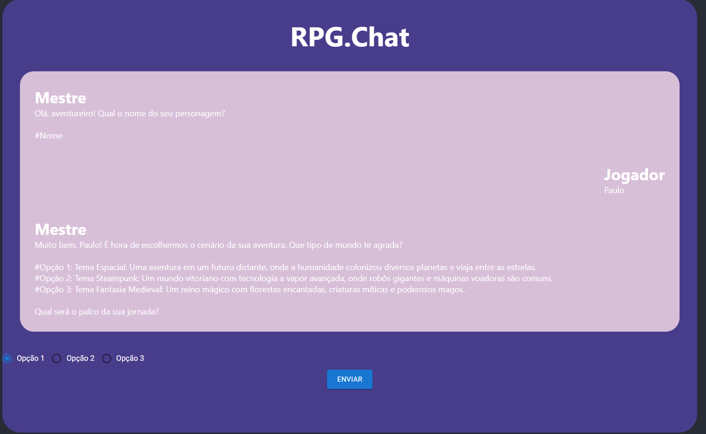

# RPG.Chat

Este é um projeto de Chat RPG, onde o usuário pode entrar em uma aventura interativa. O projeto utiliza a API Google Gemini para gerar as interações.

## Como rodar o projeto

1. Clone o repositório
2. Instale as dependências com o comando `npm install`
3. Rode o projeto com o comando `npm start`

## Jogando

Para jogar, basta inserir sua API Key do Google Gemini no campo de texto e clicar em "Entrar". A partir daí, você pode interagir com o chat e seguir a história.

### Se apresentando

Assim que definir a API Key, você será apresentado ao chat e poderá dizer o nome do seu personagem.

### Interagindo

O jogo consiste em um sistema de escolha entre 3 opções de diálogo. Cada escolha leva a uma nova interação.

## Tecnologias utilizadas

- React
- Material UI
- Google Gemini API

## Desenvolvedores
Paulo Henrique de Oliveira Arantes Ferreira
